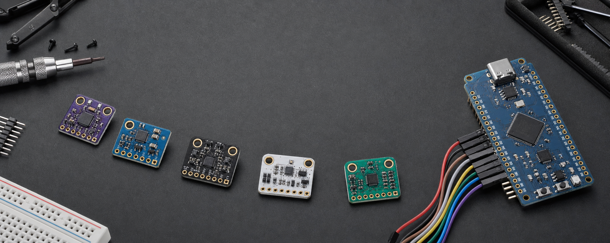

<p align="center">
  
</p>

<h1 align="center">NiusIMU</h1>

<p align="center">
  One Arduino-style motion API for real marketplace modules, clone populations,
  and modern sensor-fusion silicon on ArduinoNRF.
</p>

<p align="center">
  <a href="https://github.com/dunknowcoding/ArduinoNRF-IMU/releases"></a>
  <a href="https://github.com/dunknowcoding/ArduinoNRF-IMU/blob/main/LICENSE"></a>
  
  
</p>

## Built for the modules people actually buy

| Unified surface | Marketplace-aware | Modern feature paths | ArduinoNRF-native |
| --- | --- | --- | --- |
| `begin()`, `update()`, engineering units, and calibration | Exact photographed silks, clone identities, and populated-core probing | Fusion, FIFO, auxiliary buses, FSM/MLC, ASC, OIS/EIS, high-g, and host interrupts | I2C and SPI paths compiled for the ArduinoNRF nRF52840 core |

Basic sketches stay minimal. Interrupt routing, calibration, fusion, AI,
auxiliary sensors, and protocol-specific behavior live in `Advanced` or focused
feature examples.

## Quick start

```cpp
#include <MPU9250.h>

MPU9250 imu;

void setup() {
  Serial.begin(115200);
  if (!imu.begin()) while (true) {}
}

void loop() {
  if (!imu.update()) return;

  Vec3 acceleration = imu.accelG();
  Vec3 rotation = imu.gyroDps();
  Vec3 magneticField = imu.magUT();
}
```

## Supported devices

| Family | Sensors and modules |
| --- | --- |
| InvenSense / TDK | MPU-6050, MPU-6500, MPU-6886, MPU-9250, MPU-9255, ICM-20602, ICM-20689, ICM-20948, ICM-42688-P, ICM-45686 |
| Bosch | BMI088, BMI160, BMI270, BMI323, BMX055, BNO055 |
| CEVA | BNO085, BNO086 |
| ST | LSM303DLHC, LSM303D, LSM6DS3, LSM6DS3TR-C, LSM6DSOX, LSM6DSV, LSM6DSV320X, LSM9DS1, L3G4200D, L3GD20/H |
| Other motion and magnetic | ADXL345, MMA8452Q, ITG-3200/3205, QMI8658/C, HMC5883L, QMC5883L, QMC6309 |
| Pressure | BMP180/BMP085, BMP280, MS5611 |
| Named marketplace boards | GY-45/50/63/68/80/801/85/86/87/88/91/271/273/291/511/521/9250, GY-LSM6DS3, GY-BNO055/085, GY-601N1, CJMCU-055, CJMCU-633/603F, MUMO |

The library also covers the photographed full-pin and eight-pad ICM-45686
variants, ICM-20948 ten-pad board, LSM6DSV320X and LSM6DS3TR-C boards,
SparkFun-layout BNO086 clones, and LSM303DLHC + L3GD20 marketplace clones.

See [IMU Support and Usage](docs/IMU_SUPPORT.md) for exact pin maps, core-versus-
carrier selection, clone identification, calibration workflows, limitations,
and the feature-example index.

## LSM6DSV320X without a ceiling

The friendly C++ API covers normal sampling, the independent 320 g channel,
high-g events, SFLP fusion, the sensor hub, MEMS Studio UCF loading, FSM/MLC,
and ASC. `stContext()` also exposes the complete bundled ST register driver for
FIFO, EIS/OIS, embedded events, self-test, and sensor-side MIPI I3C 1.1/IBI
configuration.

```cpp
LSM6DSV320X imu;
imu.begin();
lsm6dsv320x_fifo_watermark_set(imu.stContext(), 16);
```

## Install and build

Install **NiusIMU** from Arduino Library Manager, or compile this checkout
directly beside ArduinoNRF:

```sh
arduino-cli compile \
  --fqbn arduinonrf:nrf52:promicro_nrf52840 \
  --library <path-to>/ArduinoNRF-IMU \
  <path-to>/ArduinoNRF-IMU/examples/GY91/GY91_Basic
```

## Documentation

- [IMU support, pinouts, and usage](docs/IMU_SUPPORT.md)
- [Architecture](docs/ARCHITECTURE.md)
- [Adding a sensor](docs/ADDING_A_SENSOR.md)

NiusIMU is licensed under [Apache-2.0](LICENSE). The bundled ST
LSM6DSV320X register driver retains its BSD-3-Clause license.
